# HOTELYA — Sistema de Reserva de Hoteles

Aplicación móvil para la búsqueda, reserva y gestión de estadías en hoteles, con programa de fidelización por estrellas.

| Integrante          | Código   | GitHub                                                             |
| ------------------- | -------- | ------------------------------------------------------------------ |
| Walter Melendez     | 20231805 | [@Walturx](https://github.com/Walturx)                             |
| Jean Carlo Rado     | 20235056 | [@AidenArcadia](https://github.com/AidenArcadia)                   |
| Sebastian Candiotti | 20230977 | [@Sebastian-D-Candiotti](https://github.com/Sebastian-D-Candiotti) |
| Joaquin Gonzales    | 20231304 | [@Joaquin0804](https://github.com/Joaquin0804)                     |

---

## 1. Entorno de Desarrollo

Para el desarrollo de esta aplicación se utiliza un stack moderno que permite desarrollo multiplataforma con persistencia local.

| Herramienta            | Descripción                                             | Instalación                                                                                                                                                                  |
| ---------------------- | ------------------------------------------------------- | ---------------------------------------------------------------------------------------------------------------------------------------------------------------------------- |
| **Google Antigravity** | IDE principal para escribir código Flutter/Dart         | Descargar desde la web oficial de Google. Agregar las extensiones **Flutter** y **Dart** desde el marketplace integrado.                                                     |
| **Flutter SDK**        | Framework para el desarrollo de la app móvil Android    | Descargar el SDK, extraerlo en una carpeta local (ej. `C:\flutter`) y agregar `C:\flutter\bin` al `PATH` del sistema. Ejecutar `flutter doctor` para verificar dependencias. |
| **Android Studio**     | Gestión de emuladores y Android SDK                     | Instalar desde la web oficial. Configurar un dispositivo virtual (AVD) con API 30+.                                                                                          |
| **sqflite (SQLite3)**  | Motor de base de datos local embebido en el dispositivo | Se integra como dependencia en `pubspec.yaml`. No requiere instalación externa en el sistema.                                                                                |
| **GitHub**             | Control de versiones y publicación del proyecto         | Crear repositorio en [github.com](https://github.com) y gestionar ramas con comandos `git`.                                                                                  |

---

## 2. Requerimientos Funcionales

### 2.1. Módulo de Gestión de Alojamiento

| ID    | Requerimiento                                                                                   | Tablas                |
| ----- | ----------------------------------------------------------------------------------------------- | --------------------- |
| RF-01 | El sistema permite filtrar hoteles por país, ciudad o provincia.                                | `hotels`, `locations` |
| RF-02 | El sistema muestra la descripción, estrellas, teléfono y amenidades de un hotel seleccionado.   | `hotels`, `amenities` |
| RF-03 | El sistema lista solo las habitaciones con `is_available = true` para las fechas seleccionadas. | `rooms`               |

### 2.2. Módulo de Reservas y Pagos

| ID    | Requerimiento                                                                                              | Tablas                               |
| ----- | ---------------------------------------------------------------------------------------------------------- | ------------------------------------ |
| RF-04 | El sistema permite al usuario crear una reserva indicando fechas de entrada/salida y cantidad de personas. | `reservations`                       |
| RF-05 | El sistema calcula automáticamente el `total_price` (precio base × noches + servicios adicionales).        | `room_types`, `reservation_services` |
| RF-06 | El sistema registra el pago y actualiza el estado de la reserva a `confirmed`.                             | `payments`                           |

### 2.3. Módulo de Fidelización

| ID    | Requerimiento                                                                                                                     | Tablas                                                  |
| ----- | --------------------------------------------------------------------------------------------------------------------------------- | ------------------------------------------------------- |
| RF-07 | El sistema registra y acumula las estrellas del usuario al completar cada reserva, para que puedan ser canjeadas por recompensas. | `users`, `reservations`, `loyalty_transactions`         |
| RF-08 | El sistema permite al usuario consultar el saldo actual y el historial de transacciones de estrellas.                             | `users`, `loyalty_transactions`                         |
| RF-09 | El usuario puede canjear estrellas por recompensas activas (noches gratis, regalos).                                              | `rewards`, `reward_redemptions`, `loyalty_transactions` |

### 2.4. Módulo de Experiencia del Usuario

| ID    | Requerimiento                                                                                                                                                            | Tablas                                       |
| ----- | ------------------------------------------------------------------------------------------------------------------------------------------------------------------------ | -------------------------------------------- |
| RF-10 | El usuario puede calificar y comentar su experiencia solo después de completar su reserva.                                                                               | `reviews`, `users`, `reservations`, `hotels` |
| RF-11 | El sistema envía alertas automáticas sobre confirmación de reservas y promociones.                                                                                       | `notifications`, `users`, `reservations`     |
| RF-12 | El usuario puede actualizar sus datos personales, documento y foto de perfil.                                                                                            | `users`                                      |
| RF-13 | El usuario puede recuperar su contraseña en caso de olvido utilizando su correo electrónico registrado. El sistema envía un enlace o código temporal para restablecerla. | `users`                                      |

## 3. Requerimientos No Funcionales

| ID     | Requerimiento              | Descripción                                                                                                                             |
| ------ | -------------------------- | --------------------------------------------------------------------------------------------------------------------------------------- |
| RNF-01 | **Disponibilidad offline** | El sistema permite acceder a la información de reservas locales previamente almacenadas en el dispositivo, sin conexión a internet.     |
| RNF-02 | **Seguridad**              | Los datos sensibles del usuario (documentos, contraseña) están protegidos mediante cifrado en la base de datos local.                   |
| RNF-03 | **Rendimiento**            | El tiempo de respuesta para la búsqueda y filtrado de hoteles y habitaciones no supera los 2 segundos bajo condiciones normales de uso. |
| RNF-04 | **Portabilidad**           | El sistema puede funcionar en diferentes dispositivos android siempre y cuando tengan la configuracion de android 5.0 o superior.       |

## 4. Diagrama de Despliegue

### Diagrama de Despliegue

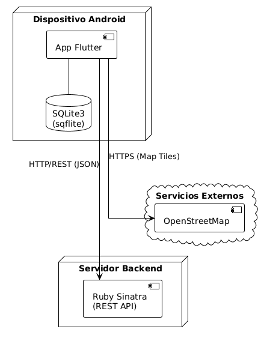

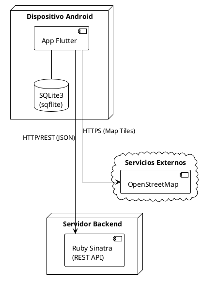
```plantuml
@startuml
!theme plain
skinparam linetype ortho

node "Dispositivo Android" as mobile {
  component "App Flutter" as flutter
  database "SQLite3\n(sqflite)" as db
  flutter -- db
}

node "Servidor Backend" as backend {
  component "Ruby Sinatra\n(REST API)" as sinatra
}

cloud "Servicios Externos" as ext {
  component "OpenStreetMap" as osm
}

flutter -----> sinatra : HTTP/REST (JSON)
flutter ----> osm : HTTPS (Map Tiles)

@enduml
```

---

## 5. Casos de Uso

### 5.1 Diagrama de Casos de Uso

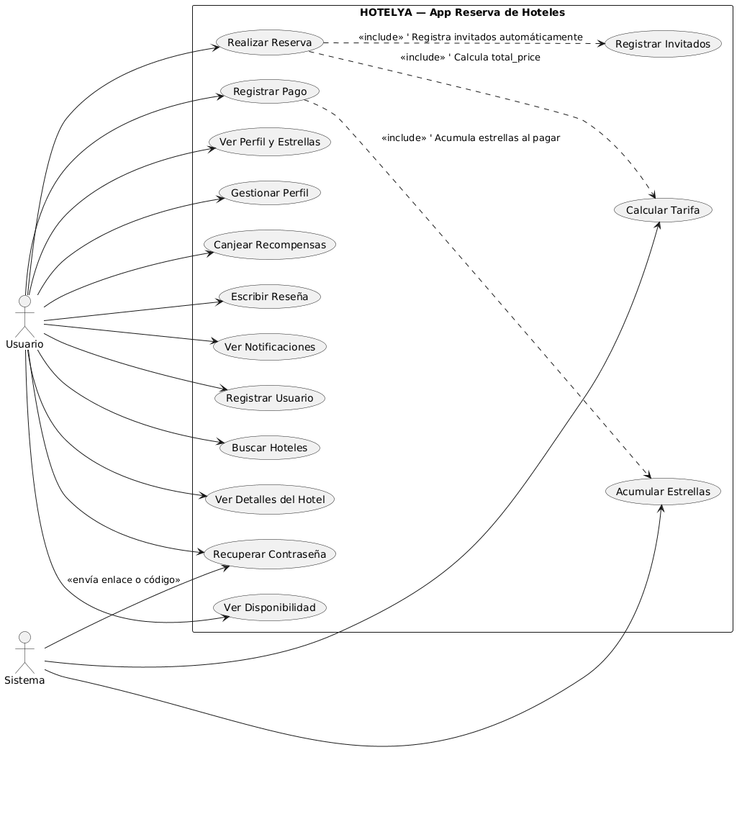

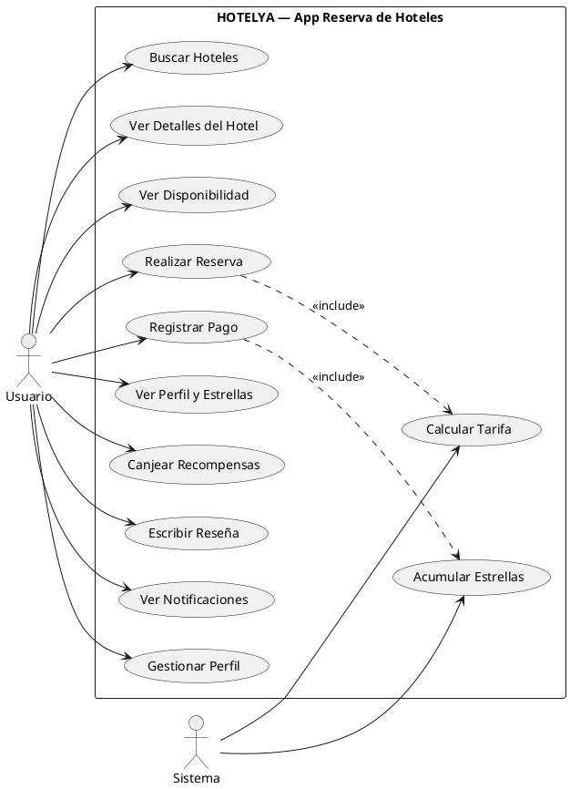
```plantuml
@startuml
left to right direction
actor "Usuario" as user
actor "Sistema" as sys

rectangle "HOTELYA — App Reserva de Hoteles" {
  usecase "Buscar Hoteles" as UC1
  usecase "Ver Detalles del Hotel" as UC2
  usecase "Ver Disponibilidad" as UC3
  usecase "Realizar Reserva" as UC4
  usecase "Calcular Tarifa" as UC5
  usecase "Registrar Pago" as UC6
  usecase "Ver Perfil y Estrellas" as UC7
  usecase "Canjear Recompensas" as UC8
  usecase "Escribir Reseña" as UC9
  usecase "Ver Notificaciones" as UC10
  usecase "Gestionar Perfil" as UC11
  usecase "Acumular Estrellas" as UC12
}

user --> UC1
user --> UC2
user --> UC3
user --> UC4
user --> UC6
user --> UC7
user --> UC8
user --> UC9
user --> UC10
user --> UC11

UC4 ..> UC5 : <<include>>
UC6 ..> UC12 : <<include>>
sys --> UC5
sys --> UC12

@enduml
```

---

## 5.2. Descripción de Casos de Uso

> Mockups disponibles en [Canva — HOTELYA](https://www.canva.com/design/DAHHtTAWlk8/VaMFZz3pSj_ZO5uHSZcFGw/edit)

### CU01: Registrar Usuario

| Campo               | Detalle                                                                                                                                                                                                                                                                                            |
| ------------------- | -------------------------------------------------------------------------------------------------------------------------------------------------------------------------------------------------------------------------------------------------------------------------------------------------- |
| **Actor**           | Usuario                                                                                                                                                                                                                                                                                            |
| **Descripción**     | Permite crear una nueva cuenta proporcionando correo, contraseña y datos personales.                                                                                                                                                                                                               |
| **Precondición**    | El usuario no debe tener una cuenta registrada en la app.                                                                                                                                                                                                                                          |
| **Flujo principal** | 1. Accede a la pantalla de registro. 2. Ingresa sus datos personales (nombre, apellidos, correo, contraseña, fecha de nacimiento, número de documento). 3. El sistema valida los datos ingresados. 4. El sistema crea el registro en `users`. 5. El usuario es redirigido a la pantalla de inicio. |
| **Tablas**          | `users`                                                                                                                                                                                                                                                                                            |

#### Mockup Registrar Usuario

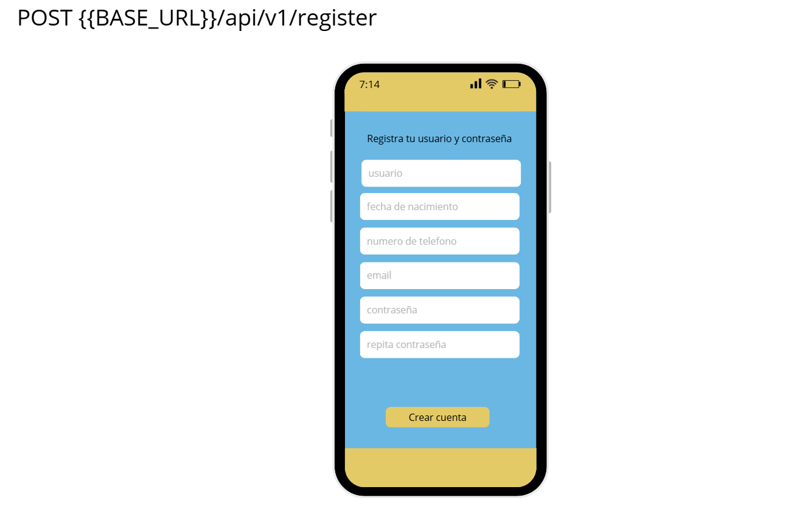

### CU02: Recuperar Contraseña

| Campo               | Detalle                                                                                                                                                                                                                                                                                                                                                             |
| ------------------- | ------------------------------------------------------------------------------------------------------------------------------------------------------------------------------------------------------------------------------------------------------------------------------------------------------------------------------------------------------------------- |
| **Actor**           | Usuario                                                                                                                                                                                                                                                                                                                                                             |
| **Descripción**     | Permite restablecer la contraseña en caso de olvido mediante correo electrónico registrado.                                                                                                                                                                                                                                                                         |
| **Precondición**    | El usuario debe tener una cuenta registrada en la app.                                                                                                                                                                                                                                                                                                              |
| **Flujo principal** | 1. Accede a la pantalla de recuperar contraseña. 2. Ingresa su correo electrónico registrado. 3. El sistema envía un código temporal para restablecerla. 4. El usuario introduce el código recibido. 5. El usuario introduce su nueva contraseña. 6. El sistema actualiza la contraseña del usuario. 7. El usuario es redirigido a la pantalla de inicio de sesión. |
| **Tablas**          | `users`                                                                                                                                                                                                                                                                                                                                                             |

#### Mockup CU02

### New Password Email

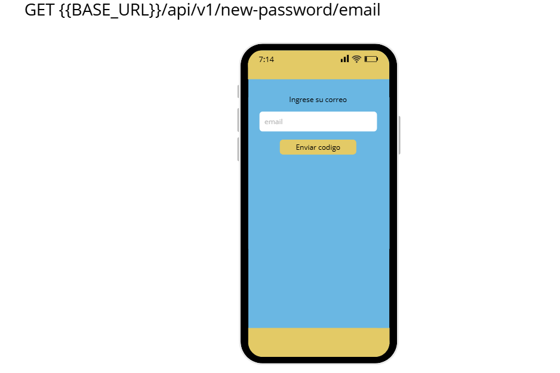

### New Password Code

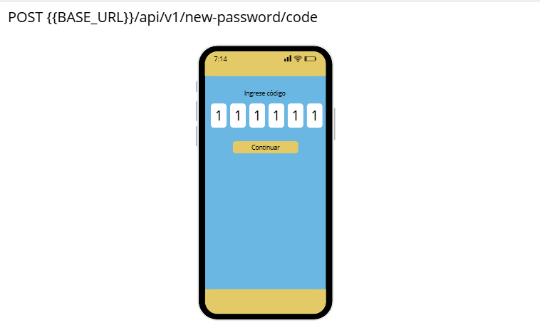

### New Password

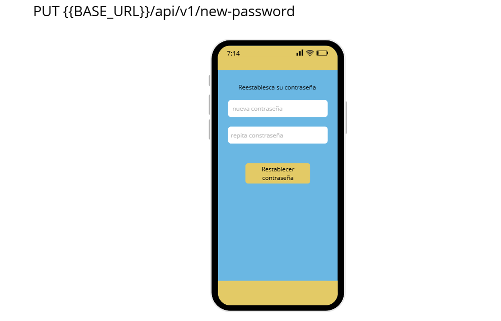

### CU03: Iniciar Sesión

| Campo               | Detalle                                                                                                                                                                                                     |
| ------------------- | ----------------------------------------------------------------------------------------------------------------------------------------------------------------------------------------------------------- |
| **Actor**           | Usuario                                                                                                                                                                                                     |
| **Descripción**     | Permite al usuario iniciar sesión en la app con su usuario y contraseña.                                                                                                                                    |
| **Precondición**    | El usuario debe tener una cuenta registrada en la app.                                                                                                                                                      |
| **Flujo principal** | 1. Accede a la pantalla de inicio de sesión. 2. Ingresa su usuario y contraseña. 3. El sistema valida los datos ingresados. 4. El usuario es redirigido a la pantalla de inicio.                            |
| **Flujo alterno**   | 1. Si el usuario o contraseña son incorrectos: a. El sistema muestra el mensaje “Usuario o contraseña incorrectos”. 2. El usuario puede volver a intentar ingresar los datos o recuperar contraseña (CU02). |
| **Tablas**          | `users`                                                                                                                                                                                                     |

#### Mockup CU03

### Sign In


### Sign In Error

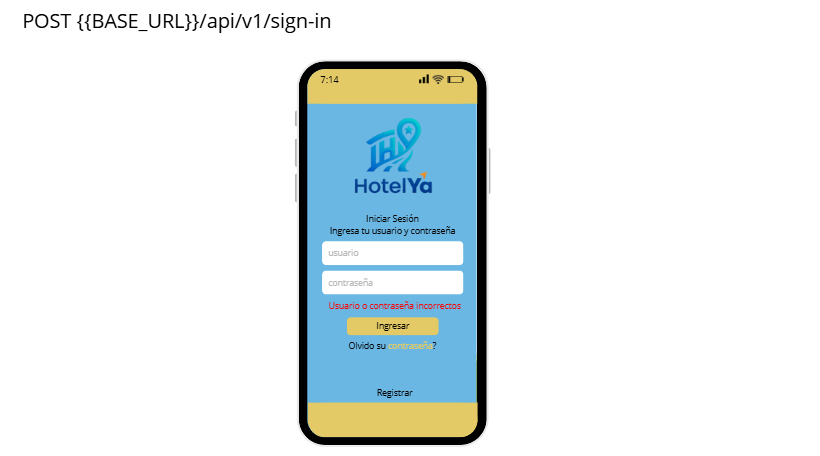

### CU04: Buscar Hoteles

| Campo               | Detalle                                                                                                                |
| ------------------- | ---------------------------------------------------------------------------------------------------------------------- |
| **Actor**           | Usuario                                                                                                                |
| **Descripción**     | Permite al usuario buscar hoteles por país y ciudad.                                                                   |
| **Precondición**    | El usuario debe estar autenticado en la app.                                                                           |
| **Flujo principal** | 1. Accede a la pantalla de búsqueda. 2. Selecciona el país y la ciudad. 3. El sistema muestra los hoteles disponibles. |
| **Tablas**          | `hotels`, `locations`                                                                                                  |

#### Mockup CU04

### Home

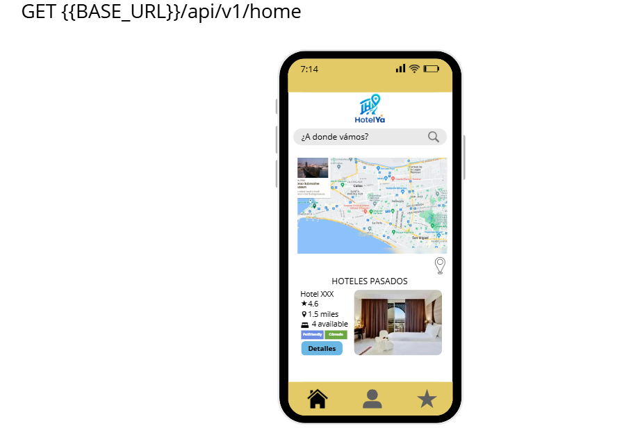

### Search

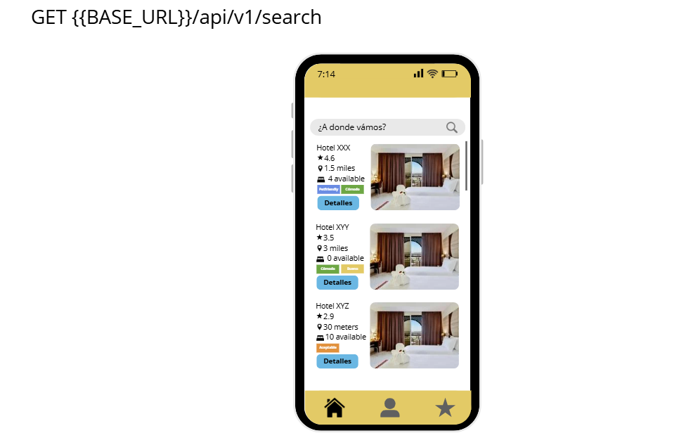

### CU05: Ver Detalles del Hotel

| Campo               | Detalle                                                                                                                                                                                                                                                                                                               |
| ------------------- | --------------------------------------------------------------------------------------------------------------------------------------------------------------------------------------------------------------------------------------------------------------------------------------------------------------------- |
| **Actor**           | Usuario                                                                                                                                                                                                                                                                                                               |
| **Descripción**     | Permite al usuario consultar la información completa de un hotel seleccionado, incluyendo descripción, estrellas, teléfono, correo, imagen principal, amenidades activas y detalles de las habitaciones disponibles.                                                                                                  |
| **Precondición**    | Usuario ha buscado hoteles y seleccionado uno de ellos.                                                                                                                                                                                                                                                               |
| **Flujo principal** | 1. Accede a la pantalla de detalles del hotel. 2. El sistema muestra los detalles del hotel. 3. El sistema muestra las habitaciones disponibles y sus tipos en la misma pantalla. 4. El usuario puede seleccionar una habitación para ver sus detalles. 5. El usuario puede seleccionar una habitación para reservar. |
| **Tablas**          | `hotels`, `rooms`, `room_types`                                                                                                                                                                                                                                                                                       |

#### Mockup CU05

### Hotel

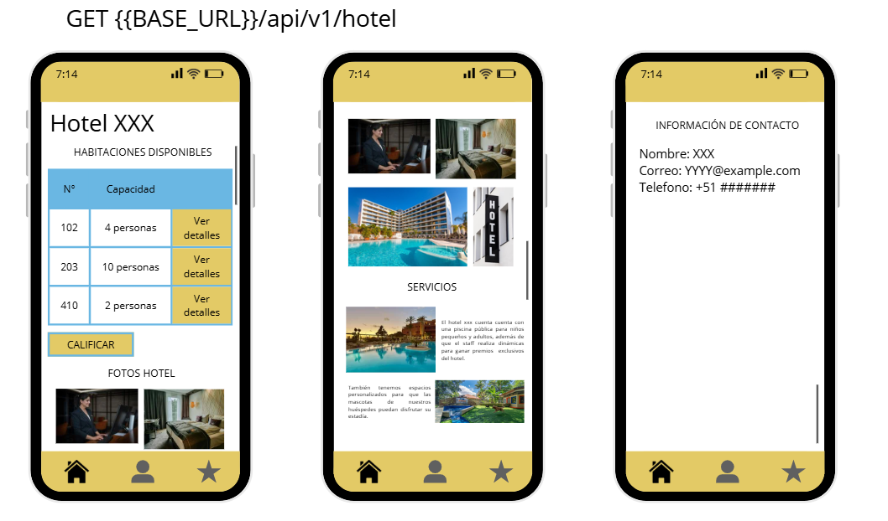

### Room Details

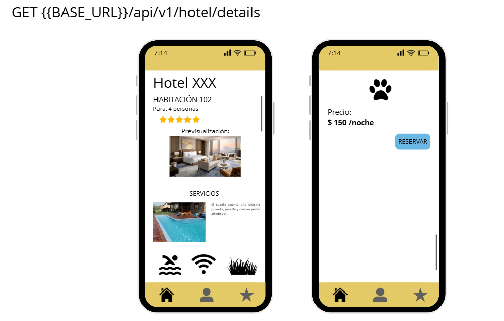

### CU06: Ver Disponibilidad

| Campo               | Detalle                                                                                                         |
| ------------------- | --------------------------------------------------------------------------------------------------------------- |
| **Actor**           | Usuario                                                                                                         |
| **Descripción**     | Permite al usuario ver la disponibilidad de habitaciones en un hotel.                                           |
| **Precondición**    | El usuario debe estar autenticado en la app.                                                                    |
| **Flujo principal** | 1. Accede a la pantalla de disponibilidad. 2. El sistema muestra la disponibilidad de habitaciones en el hotel. |
| **Tablas**          | `rooms`, `room_types`, `reservations`                                                                           |

#### Mockup CU06

### Hotel


### CU07: Realizar Reserva

| Campo               | Detalle                                                                                                                                                                                                                                                                                                     |
| ------------------- | ----------------------------------------------------------------------------------------------------------------------------------------------------------------------------------------------------------------------------------------------------------------------------------------------------------- |
| **Actor**           | Usuario                                                                                                                                                                                                                                                                                                     |
| **Descripción**     | Realiza la reserva de una habitación en un hotel.                                                                                                                                                                                                                                                           |
| **Precondición**    | El usuario debe haber seleccionado una habitación y las fechas de check-in y check-out.                                                                                                                                                                                                                     |
| **Flujo principal** | 1. Usuario selecciona hotel y habitación. 2. Ingresa fechas de check-in y check-out y datos de los invitados. 3. El sistema valida disponibilidad y calcula total_price. 4. Se crea el registro de la reserva en reservations. 5. Se crean los registros de los invitados en guests asociados a la reserva. |
| **Tablas**          | `rooms`, `reservations`, `guests`, `users`                                                                                                                                                                                                                                                                  |

#### Mockup CU07

### Hotel check-in

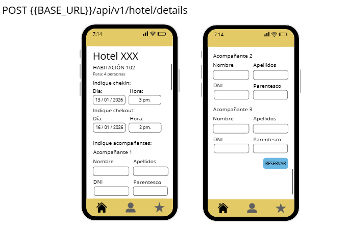

### Detalles reserva


### CU08: Calcular Tarifa

| Campo               | Detalle                                                                                                                               |
| ------------------- | ------------------------------------------------------------------------------------------------------------------------------------- |
| **Actor**           | Usuario                                                                                                                               |
| **Descripción**     | Calcula el costo total de la reserva basándose en la tarifa base de la habitación, las fechas seleccionadas y el número de personas.  |
| **Precondición**    | El usuario debe haber seleccionado una habitación y las fechas de check-in y check-out.                                               |
| **Flujo principal** | 1. El sistema calcula el costo total de la reserva. 2. El usuario ve el costo total de la reserva. 3. El usuario confirma la reserva. |
| **Tablas**          | `rooms`, `reservations`                                                                                                               |

#### Mockup CU08

### Detalles reserva


### CU09: Registrar Invitados

| Campo               | Detalle                                                                                                                                                                                                     |
| ------------------- | ----------------------------------------------------------------------------------------------------------------------------------------------------------------------------------------------------------- |
| **Actor**           | Usuario                                                                                                                                                                                                     |
| **Descripción**     | El usuario ingresa datos de uno o varios invitados para la reserva.                                                                                                                                         |
| **Precondición**    | Debe existir una reserva en estado `pending`.                                                                                                                                                               |
| **Flujo principal** | 1. Se muestra el resumen de la reserva. 2. El usuario ingresa datos de los invitados (nombre, apellidos, tipo/número de documento, nacionalidad). 3. Se crea el registro en `guests` asociado a la reserva. |
| **Tablas**          | `reservations`, `guests`                                                                                                                                                                                    |

#### Mockup CU09

### Hotel check-in


### CU10: Registrar Pago

| Campo               | Detalle                                                                                                                                                                                                                                                                                                                                 |
| ------------------- | --------------------------------------------------------------------------------------------------------------------------------------------------------------------------------------------------------------------------------------------------------------------------------------------------------------------------------------- |
| **Actor**           | Usuario                                                                                                                                                                                                                                                                                                                                 |
| **Descripción**     | El usuario registra el pago de la reserva.                                                                                                                                                                                                                                                                                              |
| **Precondición**    | Debe existir una reserva en estado `pending`.                                                                                                                                                                                                                                                                                           |
| **Flujo principal** | 1. Se muestra el resumen de la reserva. 2. El usuario registra el pago de la reserva. 3. Se actualiza el estado de la reserva a `confirmed`. 4. Se genera el pago en la tabla payments. 5. Se genera un código QR con la información de la reserva. 6. Se envia una notificación al usuario con la información de la reserva y el pago. |
| **Tablas**          | `reservations`, `payments`                                                                                                                                                                                                                                                                                                              |

#### Mockup CU10

### Payment

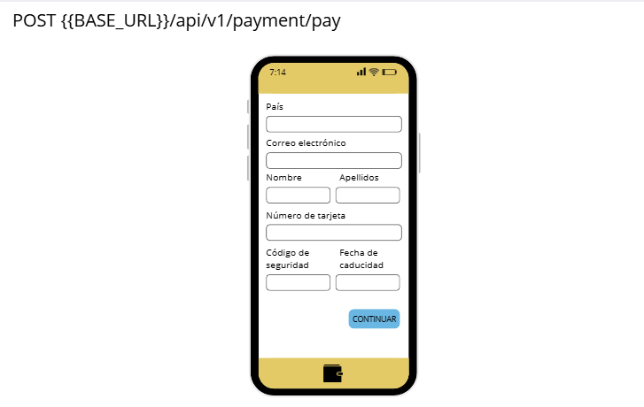

### Reservation QR Code

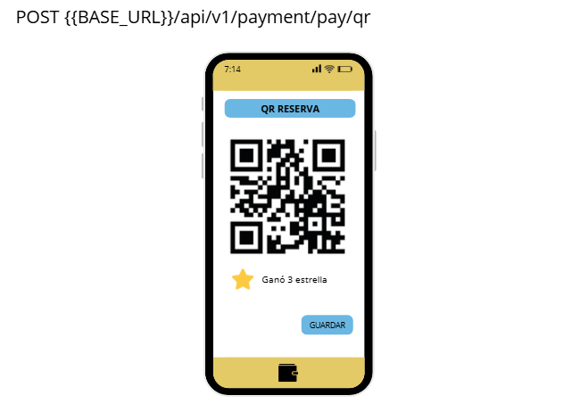

### CU11: Acumular estrellas

| Campo               | Detalle                                                                                                                                                          |
| ------------------- | ---------------------------------------------------------------------------------------------------------------------------------------------------------------- |
| **Actor**           | Usuario                                                                                                                                                          |
| **Descripción**     | El usuario acumula estrellas por cada reserva realizada.                                                                                                         |
| **Precondición**    | Debe existir una reserva en estado `confirmed`.                                                                                                                  |
| **Flujo principal** | 1. El sistema calcula el número de estrellas a acumular. 2. El usuario ve el número de estrellas acumuladas. 3. Se actualiza el número de estrellas del usuario. |
| **Tablas**          | `reservations`, `loyalty_transactions`                                                                                                                           |

#### Mockup CU11

### Reservation QR Code


### User Details

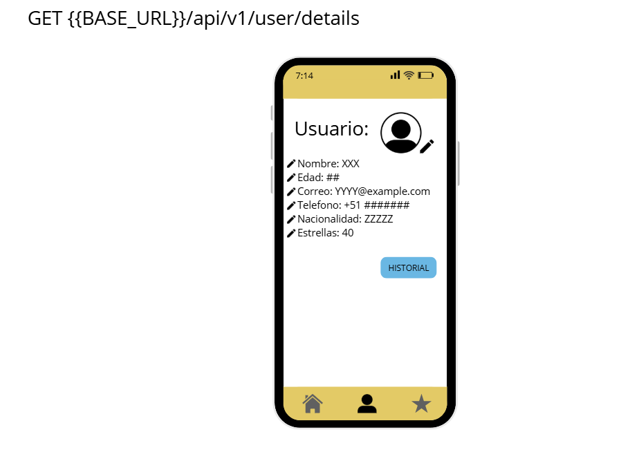

### CU12: Ver perfil y estrellas

| Campo               | Detalle                                                                                                                                                                                                                     |
| ------------------- | --------------------------------------------------------------------------------------------------------------------------------------------------------------------------------------------------------------------------- |
| **Actor**           | Usuario                                                                                                                                                                                                                     |
| **Descripción**     | El usuario ve su perfil y el número de estrellas acumuladas.                                                                                                                                                                |
| **Precondición**    | El usuario debe estar autenticado en la app.                                                                                                                                                                                |
| **Flujo principal** | 1. El usuario accede a su perfil. 2. El sistema muestra los datos del usuario y el número de estrellas acumuladas. 3. El usuario puede ver su historial de reservas. 4. El usuario puede ver su historial de transacciones. |
| **Tablas**          | `users`, `loyalty_transactions`                                                                                                                                                                                             |

#### Mockup CU12

### User Details


### User Record

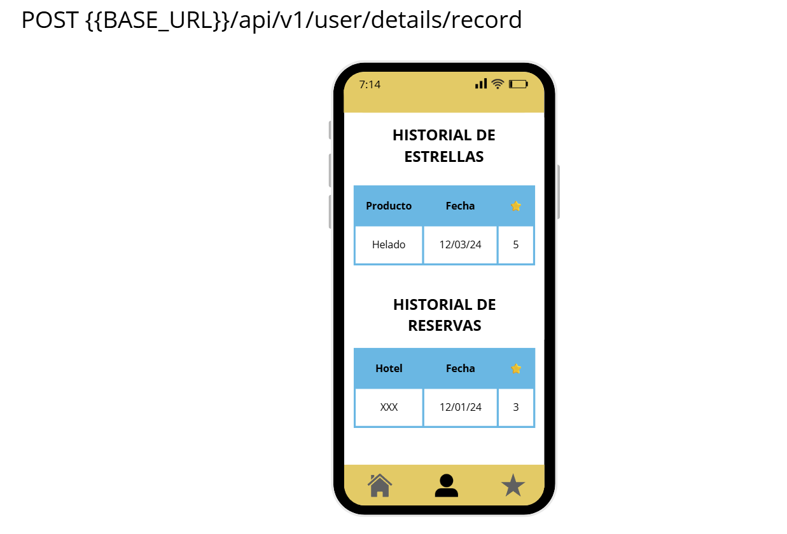

### CU13: Modificar perfil

| Campo               | Detalle                                                                                                                                                 |
| ------------------- | ------------------------------------------------------------------------------------------------------------------------------------------------------- |
| **Actor**           | Usuario                                                                                                                                                 |
| **Descripción**     | El usuario modifica su perfil.                                                                                                                          |
| **Precondición**    | El usuario debe estar autenticado en la app.                                                                                                            |
| **Flujo principal** | 1. El usuario accede a su perfil. 2. El sistema muestra el perfil del usuario. 3. El usuario modifica su perfil. 4. Se actualiza el perfil del usuario. |
| **Tablas**          | `users`                                                                                                                                                 |

#### Mockup CU13

### User Details


### CU14: Canjear recompensas

| Campo               | Detalle                                                                                                                                                                       |
| ------------------- | ----------------------------------------------------------------------------------------------------------------------------------------------------------------------------- |
| **Actor**           | Usuario                                                                                                                                                                       |
| **Descripción**     | El usuario canjea recompensas.                                                                                                                                                |
| **Precondición**    | El usuario debe estar autenticado en la app.                                                                                                                                  |
| **Flujo principal** | 1. El usuario accede a su perfil. 2. El sistema muestra las recompensas disponibles. 3. El usuario canjea una recompensa. 4. Se actualiza el número de estrellas del usuario. |
| **Tablas**          | `users`, `rewards`, `reward_redemptions`                                                                                                                                      |

#### Mockup CU14

### Star Shop

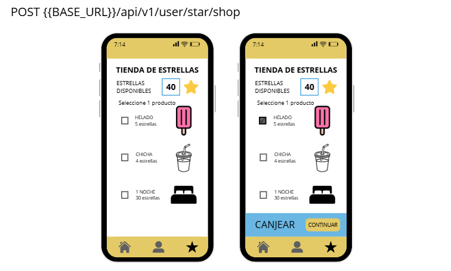

### Star Buy

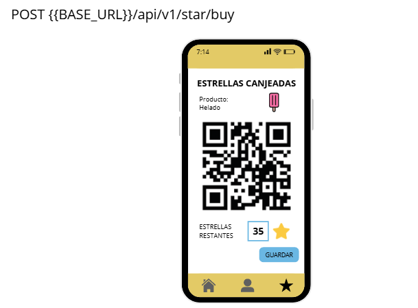

### CU15: Escribir reseña

| Campo               | Detalle                                                                                                                                                                                         |
| ------------------- | ----------------------------------------------------------------------------------------------------------------------------------------------------------------------------------------------- |
| **Actor**           | Usuario                                                                                                                                                                                         |
| **Descripción**     | El usuario escribe una reseña para una reserva.                                                                                                                                                 |
| **Precondición**    | Debe existir una reserva en estado `confirmed`.                                                                                                                                                 |
| **Flujo principal** | 1. El usuario accede a su perfil. 2. El sistema muestra las reservas realizadas. 3. El usuario selecciona una reserva. 4. El usuario escribe una reseña. 5. Se actualiza la reseña del usuario. |
| **Tablas**          | `users`, `reservations`, `reviews`                                                                                                                                                              |

#### Mockup CU15

### Comments

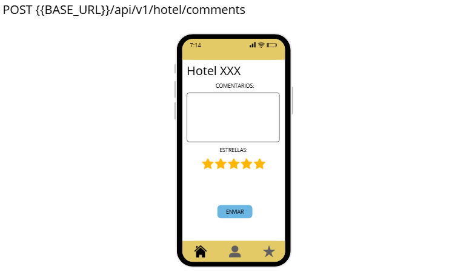

### CU16: Ver Notificaciones

| Campo               | Detalle                                                                                                          |
| ------------------- | ---------------------------------------------------------------------------------------------------------------- |
| **Actor**           | Usuario                                                                                                          |
| **Descripción**     | El usuario ve sus notificaciones.                                                                                |
| **Precondición**    | El usuario debe estar autenticado en la app.                                                                     |
| **Flujo principal** | 1. El usuario accede a su perfil. 2. El sistema muestra las notificaciones. 3. El usuario ve las notificaciones. |
| **Tablas**          | `users`, `reservations`, `reviews`                                                                               |

---

## 6. Modelo de Base de Datos

### Diagrama Entidad-Relación

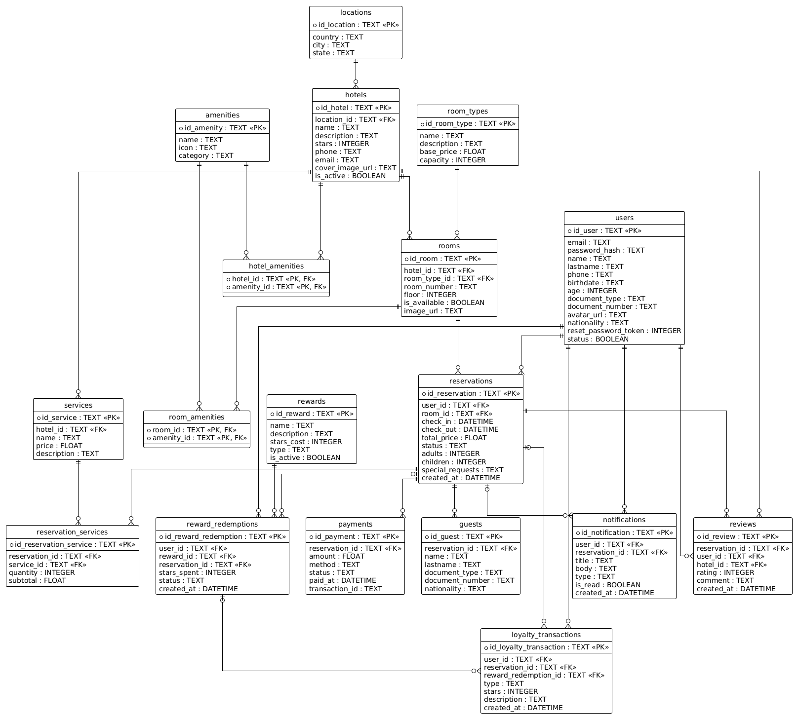

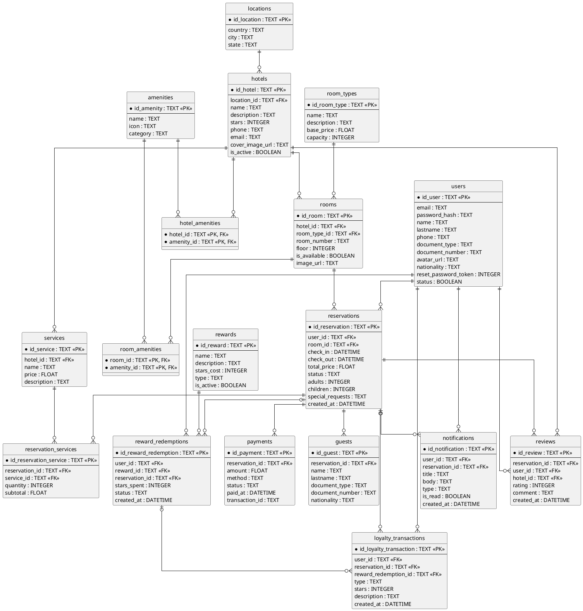
```plantuml
@startuml
hide circle
skinparam linetype ortho

entity "locations" as Locations {
  * id_location : TEXT <<PK>>
  --
  country : TEXT
  city : TEXT
  state : TEXT
}

entity "hotels" as Hotels {
  * id_hotel : TEXT <<PK>>
  --
  location_id : TEXT <<FK>>
  name : TEXT
  description : TEXT
  stars : INTEGER
  phone : TEXT
  email : TEXT
  cover_image_url : TEXT
  is_active : BOOLEAN
}

entity "room_types" as RoomTypes {
  * id_room_type : TEXT <<PK>>
  --
  name : TEXT
  description : TEXT
  base_price : FLOAT
  capacity : INTEGER
}

entity "rooms" as Rooms {
  * id_room : TEXT <<PK>>
  --
  hotel_id : TEXT <<FK>>
  room_type_id : TEXT <<FK>>
  room_number : TEXT
  floor : INTEGER
  is_available : BOOLEAN
  image_url : TEXT
}

entity "users" as Users {
  * id_user : TEXT <<PK>>
  --
  email : TEXT
  password_hash : TEXT
  name : TEXT
  lastname : TEXT
  phone : TEXT
  document_type : TEXT
  document_number : TEXT
  avatar_url : TEXT
  nationality : TEXT
  reset_password_token : INTEGER
  status : BOOLEAN
}

entity "guests" as Guests {
  * id_guest : TEXT <<PK>>
  --
  reservation_id : TEXT <<FK>>
  name : TEXT
  lastname : TEXT
  document_type : TEXT
  document_number : TEXT
  nationality : TEXT
}

entity "reservations" as Reservations {
  * id_reservation : TEXT <<PK>>
  --
  user_id : TEXT <<FK>>
  room_id : TEXT <<FK>>
  check_in : DATETIME
  check_out : DATETIME
  total_price : FLOAT
  status : TEXT
  adults : INTEGER
  children : INTEGER
  special_requests : TEXT
  created_at : DATETIME
}

entity "payments" as Payments {
  * id_payment : TEXT <<PK>>
  --
  reservation_id : TEXT <<FK>>
  amount : FLOAT
  method : TEXT
  status : TEXT
  paid_at : DATETIME
  transaction_id : TEXT
}

entity "amenities" as Amenities {
  * id_amenity : TEXT <<PK>>
  --
  name : TEXT
  icon : TEXT
  category : TEXT
}

entity "hotel_amenities" as HotelAmenities {
  * hotel_id : TEXT <<PK, FK>>
  * amenity_id : TEXT <<PK, FK>>
}

entity "room_amenities" as RoomAmenities {
  * room_id : TEXT <<PK, FK>>
  * amenity_id : TEXT <<PK, FK>>
}

entity "services" as Services {
  * id_service : TEXT <<PK>>
  --
  hotel_id : TEXT <<FK>>
  name : TEXT
  price : FLOAT
  description : TEXT
}

entity "reservation_services" as ReservationServices {
  * id_reservation_service : TEXT <<PK>>
  --
  reservation_id : TEXT <<FK>>
  service_id : TEXT <<FK>>
  quantity : INTEGER
  subtotal : FLOAT
}

entity "loyalty_transactions" as LoyaltyTransactions {
  * id_loyalty_transaction : TEXT <<PK>>
  --
  user_id : TEXT <<FK>>
  reservation_id : TEXT <<FK>>
  reward_redemption_id : TEXT <<FK>>
  type : TEXT
  stars : INTEGER
  description : TEXT
  created_at : DATETIME
}

entity "rewards" as Rewards {
  * id_reward : TEXT <<PK>>
  --
  name : TEXT
  description : TEXT
  stars_cost : INTEGER
  type : TEXT
  is_active : BOOLEAN
}

entity "reward_redemptions" as RewardRedemptions {
  * id_reward_redemption : TEXT <<PK>>
  --
  user_id : TEXT <<FK>>
  reward_id : TEXT <<FK>>
  reservation_id : TEXT <<FK>>
  stars_spent : INTEGER
  status : TEXT
  created_at : DATETIME
}

entity "reviews" as Reviews {
  * id_review : TEXT <<PK>>
  --
  reservation_id : TEXT <<FK>>
  user_id : TEXT <<FK>>
  hotel_id : TEXT <<FK>>
  rating : INTEGER
  comment : TEXT
  created_at : DATETIME
}

entity "notifications" as Notifications {
  * id_notification : TEXT <<PK>>
  --
  user_id : TEXT <<FK>>
  reservation_id : TEXT <<FK>>
  title : TEXT
  body : TEXT
  type : TEXT
  is_read : BOOLEAN
  created_at : DATETIME
}

' --- RELACIONES ---
Locations ||--o{ Hotels
Hotels ||--o{ Rooms
RoomTypes ||--o{ Rooms
Users ||--o{ Reservations
Rooms ||--o{ Reservations
Reservations ||--o{ Guests
Reservations ||--o{ Payments
Reservations ||--o{ ReservationServices
Services ||--o{ ReservationServices
Hotels ||--o{ Services
Hotels ||--o{ HotelAmenities
Amenities ||--o{ HotelAmenities
Rooms ||--o{ RoomAmenities
Amenities ||--o{ RoomAmenities
Users ||--o{ LoyaltyTransactions
Reservations |o--o{ LoyaltyTransactions
RewardRedemptions |o--o{ LoyaltyTransactions
Users ||--o{ RewardRedemptions
Rewards ||--o{ RewardRedemptions
Reservations |o--o{ RewardRedemptions
Reservations ||--o{ Reviews
Users ||--o{ Reviews
Hotels ||--o{ Reviews
Users ||--o{ Notifications
Reservations |o--o{ Notifications

@enduml
```

### DDL SQLite3

> Tipos usados: `TEXT` para IDs (UUID), cadenas y fechas ISO8601 (`YYYY-MM-DD HH:MM:SS`). `INTEGER` para enteros y booleanos (0/1). `REAL` para decimales.

```sql
-- 1. location
CREATE TABLE location (
    id_location TEXT PRIMARY KEY,
    country TEXT NOT NULL,
    city TEXT NOT NULL,
    state TEXT NOT NULL
);

-- 2. hotel
CREATE TABLE hotel (
    id_hotel TEXT PRIMARY KEY,
    location_id TEXT NOT NULL,
    name TEXT NOT NULL,
    description TEXT,
    stars INTEGER CHECK (stars BETWEEN 1 AND 5),
    phone TEXT,
    email TEXT,
    cover_image_url TEXT,
    is_active BOOLEAN,
    FOREIGN KEY (location_id) REFERENCES location(id_location)
);

-- 3. room_type
CREATE TABLE room_type (
    id_room_type TEXT PRIMARY KEY,
    name TEXT NOT NULL,
    description TEXT,
    base_price FLOAT NOT NULL DEFAULT 0,
    capacity INTEGER NOT NULL
);

-- 4. room
CREATE TABLE room (
    id_room TEXT PRIMARY KEY,
    hotel_id TEXT NOT NULL,
    room_type_id TEXT NOT NULL,
    room_number TEXT NOT NULL,
    floor INTEGER,
    is_available BOOLEAN,
    image_url TEXT,
    FOREIGN KEY (hotel_id) REFERENCES hotel(id_hotel),
    FOREIGN KEY (room_type_id) REFERENCES room_type(id_room_type)
);

-- 5. user
CREATE TABLE user (
    id_user TEXT PRIMARY KEY,
    email TEXT NOT NULL,
    password_hash TEXT NOT NULL,
    name TEXT NOT NULL,
    lastname TEXT,
    phone TEXT,
    document_type TEXT,
    document_number TEXT UNIQUE,
    avatar_url TEXT,
    nationality TEXT,
    reset_password_token INTEGER,
    status BOOLEAN
);

-- 6. guest
CREATE TABLE guest (
    id_guest TEXT PRIMARY KEY,
    reservation_id TEXT NOT NULL,
    name TEXT NOT NULL,
    lastname TEXT,
    document_type TEXT,
    document_number TEXT UNIQUE,
    nationality TEXT,
    FOREIGN KEY (reservation_id) REFERENCES reservation(id_reservation)
);

-- 7. reservation
CREATE TABLE reservation (
    id_reservation TEXT PRIMARY KEY,
    user_id TEXT NOT NULL,
    room_id TEXT NOT NULL,
    check_in DATETIME NOT NULL,
    check_out DATETIME NOT NULL,
    total_price FLOAT NOT NULL,
    status TEXT DEFAULT 'pending',
    adults INTEGER DEFAULT 1,
    children INTEGER DEFAULT 0,
    special_requests TEXT,
    created_at DATETIME DEFAULT CURRENT_TIMESTAMP,
    FOREIGN KEY (user_id) REFERENCES user(id_user),
    FOREIGN KEY (room_id) REFERENCES room(id_room)
);

-- 8. payment
CREATE TABLE payment (
    id_payment TEXT PRIMARY KEY,
    reservation_id TEXT NOT NULL,
    amount FLOAT NOT NULL,
    method TEXT,
    status TEXT DEFAULT 'pending',
    paid_at DATETIME,
    transaction_id TEXT,
    FOREIGN KEY (reservation_id) REFERENCES reservation(id_reservation)
);

-- 9. amenity
CREATE TABLE amenity (
    id_amenity TEXT PRIMARY KEY,
    name TEXT NOT NULL,
    icon TEXT,
    category TEXT
);

-- 10. hotel_amenity
CREATE TABLE hotel_amenity (
    hotel_id TEXT NOT NULL,
    amenity_id TEXT NOT NULL,
    PRIMARY KEY (hotel_id, amenity_id),
    FOREIGN KEY (hotel_id) REFERENCES hotel(id_hotel),
    FOREIGN KEY (amenity_id) REFERENCES amenity(id_amenity)
);

-- 11. room_amenity
CREATE TABLE room_amenity (
    room_id TEXT NOT NULL,
    amenity_id TEXT NOT NULL,
    PRIMARY KEY (room_id, amenity_id),
    FOREIGN KEY (room_id) REFERENCES room(id_room),
    FOREIGN KEY (amenity_id) REFERENCES amenity(id_amenity)
);

-- 12. service
CREATE TABLE service (
    id_service TEXT PRIMARY KEY,
    hotel_id TEXT NOT NULL,
    name TEXT NOT NULL,
    price FLOAT NOT NULL,
    description TEXT,
    FOREIGN KEY (hotel_id) REFERENCES hotel(id_hotel)
);

-- 13. reservation_service
CREATE TABLE reservation_service (
    id_reservation_service TEXT PRIMARY KEY,
    reservation_id TEXT NOT NULL,
    service_id TEXT NOT NULL,
    quantity INTEGER DEFAULT 1,
    subtotal FLOAT NOT NULL,
    FOREIGN KEY (reservation_id) REFERENCES reservation(id_reservation),
    FOREIGN KEY (service_id) REFERENCES service(id_service)
);

-- 14. loyalty_transaction
CREATE TABLE loyalty_transaction (
    id_loyalty_transaction TEXT PRIMARY KEY,
    user_id TEXT NOT NULL,
    reservation_id TEXT,
    reward_redemption_id TEXT,
    type TEXT NOT NULL,
    stars INTEGER NOT NULL,
    description TEXT,
    created_at DATETIME DEFAULT CURRENT_TIMESTAMP,
    FOREIGN KEY (user_id) REFERENCES user(id_user),
    FOREIGN KEY (reservation_id) REFERENCES reservation(id_reservation),
    FOREIGN KEY (reward_redemption_id) REFERENCES reward_redemption(id_reward_redemption)
);

-- 15. reward
CREATE TABLE reward (
    id_reward TEXT PRIMARY KEY,
    name TEXT NOT NULL,
    description TEXT,
    stars_cost INTEGER NOT NULL,
    type TEXT,
    is_active BOOLEAN
);

-- 16. reward_redemption
CREATE TABLE reward_redemption (
    id_reward_redemption TEXT PRIMARY KEY,
    user_id TEXT NOT NULL,
    reward_id TEXT NOT NULL,
    reservation_id TEXT,
    stars_spent INTEGER NOT NULL,
    status TEXT DEFAULT 'pending',
    created_at DATETIME DEFAULT CURRENT_TIMESTAMP,
    FOREIGN KEY (user_id) REFERENCES user(id_user),
    FOREIGN KEY (reward_id) REFERENCES reward(id_reward),
    FOREIGN KEY (reservation_id) REFERENCES reservation(id_reservation)
);

-- 17. review
CREATE TABLE review (
    id_review TEXT PRIMARY KEY,
    reservation_id TEXT NOT NULL,
    user_id TEXT NOT NULL,
    hotel_id TEXT NOT NULL,
    rating INTEGER CHECK (rating BETWEEN 1 AND 5),
    comment TEXT,
    created_at DATETIME DEFAULT CURRENT_TIMESTAMP,
    FOREIGN KEY (reservation_id) REFERENCES reservation(id_reservation),
    FOREIGN KEY (user_id) REFERENCES user(id_user),
    FOREIGN KEY (hotel_id) REFERENCES hotel(id_hotel)
);

-- 18. notification
CREATE TABLE notification (
    id_notification TEXT PRIMARY KEY,
    user_id TEXT NOT NULL,
    reservation_id TEXT,
    title TEXT NOT NULL,
    body TEXT NOT NULL,
    type TEXT,
    is_read BOOLEAN,
    created_at DATETIME DEFAULT CURRENT_TIMESTAMP,
    FOREIGN KEY (user_id) REFERENCES user(id_user),
    FOREIGN KEY (reservation_id) REFERENCES reservation(id_reservation)
);
```

---

## 7. Diccionario de Datos

### locations

| Columna | Tipo | Restricciones | Descripción              |
| ------- | ---- | ------------- | ------------------------ |
| id      | TEXT | PK            | UUID identificador único |
| country | TEXT | NOT NULL      | País                     |
| city    | TEXT | NOT NULL      | Ciudad                   |
| state   | TEXT | NOT NULL      | Provincia / Estado       |

### hotels

| Columna         | Tipo    | Restricciones  | Descripción              |
| --------------- | ------- | -------------- | ------------------------ |
| id              | TEXT    | PK             | UUID identificador único |
| location_id     | TEXT    | FK → locations | Ubicación del hotel      |
| name            | TEXT    | NOT NULL       | Nombre del hotel         |
| description     | TEXT    |                | Descripción general      |
| stars           | INTEGER | CHECK 1–5      | Categoría en estrellas   |
| phone           | TEXT    |                | Teléfono de contacto     |
| email           | TEXT    |                | Email de contacto        |
| cover_image_url | TEXT    |                | URL imagen principal     |
| is_active       | INTEGER | DEFAULT 1      | 1 = activo, 0 = inactivo |

### room_types

| Columna     | Tipo    | Restricciones | Descripción                  |
| ----------- | ------- | ------------- | ---------------------------- |
| id          | TEXT    | PK            | UUID identificador único     |
| name        | TEXT    | NOT NULL      | Simple, Doble, Suite, etc.   |
| description | TEXT    |               | Descripción del tipo         |
| base_price  | REAL    | NOT NULL      | Precio base por noche        |
| capacity    | INTEGER | NOT NULL, > 0 | Capacidad máxima de personas |

### rooms

| Columna      | Tipo    | Restricciones   | Descripción                       |
| ------------ | ------- | --------------- | --------------------------------- |
| id           | TEXT    | PK              | UUID identificador único          |
| hotel_id     | TEXT    | FK → hotels     | Hotel al que pertenece            |
| room_type_id | TEXT    | FK → room_types | Tipo de habitación                |
| room_number  | TEXT    | NOT NULL        | Número/código de habitación       |
| floor        | INTEGER |                 | Piso                              |
| is_available | INTEGER | DEFAULT 1       | 1 = disponible, 0 = no disponible |
| image_url    | TEXT    |                 | URL imagen de la habitación       |

### users

| Columna              | Tipo    | Restricciones    | Descripción                           |
| -------------------- | ------- | ---------------- | ------------------------------------- |
| id                   | TEXT    | PK               | UUID identificador único              |
| email                | TEXT    | NOT NULL, UNIQUE | Correo electrónico (usado para login) |
| password_hash        | TEXT    | NOT NULL         | Hash de la contraseña (bcrypt)        |
| name                 | TEXT    | NOT NULL         | Nombre                                |
| lastname             | TEXT    | NOT NULL         | Apellido                              |
| phone                | TEXT    |                  | Teléfono                              |
| document_type        | TEXT    |                  | DNI / Pasaporte / CE                  |
| document_number      | TEXT    | UNIQUE           | Número de documento                   |
| avatar_url           | TEXT    |                  | URL foto de perfil                    |
| nationality          | TEXT    |                  | Nacionalidad                          |
| reset_password_token | INTEGER |                  | Token para restablecer contraseña     |
| status               | BOOLEAN |                  | TRUE = activo, FALSE = inactivo       |

### guests

| Columna         | Tipo | Restricciones               | Descripción                               |
| --------------- | ---- | --------------------------- | ----------------------------------------- |
| id              | TEXT | PK                          | UUID identificador único                  |
| reservation_id  | TEXT | FK → reservations, NOT NULL | Reserva a la que pertenece el acompañante |
| name            | TEXT | NOT NULL                    | Nombre del acompañante                    |
| lastname        | TEXT | NOT NULL                    | Apellido del acompañante                  |
| document_type   | TEXT |                             | DNI / Pasaporte / CE                      |
| document_number | TEXT |                             | Número de documento                       |
| nationality     | TEXT |                             | Nacionalidad                              |

### reservations

| Columna          | Tipo     | Restricciones             | Descripción                                   |
| ---------------- | -------- | ------------------------- | --------------------------------------------- |
| id               | TEXT     | PK                        | UUID identificador único                      |
| user_id          | TEXT     | FK → users                | Usuario que realiza la reserva                |
| room_id          | TEXT     | FK → rooms                | Habitación reservada                          |
| check_in         | TEXT     | NOT NULL                  | Fecha y hora de entrada (YYYY-MM-DD HH:MM:SS) |
| check_out        | TEXT     | NOT NULL                  | Fecha y hora de salida (YYYY-MM-DD HH:MM:SS)  |
| total_price      | REAL     | NOT NULL                  | Precio total calculado                        |
| status           | TEXT     | DEFAULT 'pending'         | pending / confirmed / cancelled / completed   |
| adults           | INTEGER  | DEFAULT 1                 | Cantidad de adultos                           |
| children         | INTEGER  | DEFAULT 0                 | Cantidad de niños                             |
| special_requests | TEXT     |                           | Solicitudes especiales                        |
| created_at       | DATETIME | DEFAULT CURRENT_TIMESTAMP | Fecha de creación                             |

### payments

| Columna        | Tipo | Restricciones     | Descripción                                 |
| -------------- | ---- | ----------------- | ------------------------------------------- |
| id             | TEXT | PK                | UUID identificador único                    |
| reservation_id | TEXT | FK → reservations | Reserva asociada                            |
| amount         | REAL | NOT NULL          | Monto pagado                                |
| method         | TEXT |                   | card / transfer / cash                      |
| status         | TEXT | DEFAULT 'pending' | pending / approved / refunded               |
| paid_at        | TEXT |                   | Fecha y hora del pago (YYYY-MM-DD HH:MM:SS) |
| transaction_id | TEXT |                   | ID externo del pago                         |

### reviews

| Columna        | Tipo     | Restricciones             | Descripción                   |
| -------------- | -------- | ------------------------- | ----------------------------- |
| id             | TEXT     | PK                        | UUID identificador único      |
| reservation_id | TEXT     | FK → reservations, UNIQUE | Una reseña por reserva        |
| user_id        | TEXT     | FK → users                | Usuario que escribe la reseña |
| hotel_id       | TEXT     | FK → hotels               | Hotel reseñado                |
| rating         | INTEGER  | CHECK 1–5                 | Calificación                  |
| comment        | TEXT     |                           | Comentario                    |
| created_at     | DATETIME | DEFAULT CURRENT_TIMESTAMP | Fecha de la reseña            |

### amenities

| Columna  | Tipo | Restricciones    | Descripción                   |
| -------- | ---- | ---------------- | ----------------------------- |
| id       | TEXT | PK               | UUID identificador único      |
| name     | TEXT | NOT NULL         | WiFi, Piscina, Gimnasio, etc. |
| icon     | TEXT |                  | Nombre del ícono              |
| category | TEXT | CHECK hotel/room | Aplica a hotel o habitación   |

### hotel_amenities

| Columna    | Tipo | Restricciones      | Descripción |
| ---------- | ---- | ------------------ | ----------- |
| hotel_id   | TEXT | PK, FK → hotels    | Hotel       |
| amenity_id | TEXT | PK, FK → amenities | Amenidad    |

### room_amenities

| Columna    | Tipo | Restricciones      | Descripción |
| ---------- | ---- | ------------------ | ----------- |
| room_id    | TEXT | PK, FK → rooms     | Habitación  |
| amenity_id | TEXT | PK, FK → amenities | Amenidad    |

### services

| Columna     | Tipo | Restricciones | Descripción                   |
| ----------- | ---- | ------------- | ----------------------------- |
| id          | TEXT | PK            | UUID identificador único      |
| hotel_id    | TEXT | FK → hotels   | Hotel que ofrece el servicio  |
| name        | TEXT | NOT NULL      | Desayuno, Spa, Transfer, etc. |
| price       | REAL | NOT NULL      | Precio del servicio           |
| description | TEXT |               | Descripción                   |

### reservation_services

| Columna        | Tipo    | Restricciones     | Descripción               |
| -------------- | ------- | ----------------- | ------------------------- |
| id             | TEXT    | PK                | UUID identificador único  |
| reservation_id | TEXT    | FK → reservations | Reserva asociada          |
| service_id     | TEXT    | FK → services     | Servicio contratado       |
| quantity       | INTEGER | DEFAULT 1         | Cantidad contratada       |
| subtotal       | REAL    | NOT NULL          | Precio total del servicio |

### loyalty_transactions

| Columna              | Tipo     | Restricciones                     | Descripción                             |
| -------------------- | -------- | --------------------------------- | --------------------------------------- |
| id                   | TEXT     | PK                                | UUID identificador único                |
| user_id              | TEXT     | FK → users                        | Usuario                                 |
| reservation_id       | TEXT     | FK → reservations, nullable       | Reserva origen (si aplica)              |
| reward_redemption_id | TEXT     | FK → reward_redemptions, nullable | Canje origen (si aplica)                |
| type                 | TEXT     | NOT NULL                          | earned / redeemed / bonus / expired     |
| stars                | INTEGER  | NOT NULL                          | Positivo = ganadas, negativo = gastadas |
| description          | TEXT     |                                   | Motivo del movimiento                   |
| created_at           | DATETIME | DEFAULT CURRENT_TIMESTAMP         | Fecha del movimiento                    |

### rewards

| Columna     | Tipo    | Restricciones | Descripción                               |
| ----------- | ------- | ------------- | ----------------------------------------- |
| id          | TEXT    | PK            | UUID identificador único                  |
| name        | TEXT    | NOT NULL      | Noche gratis, Upgrade, Desayuno, etc.     |
| description | TEXT    |               | Descripción del beneficio                 |
| stars_cost  | INTEGER | NOT NULL      | Estrellas necesarias para canjear         |
| type        | TEXT    |               | discount / free_night / service / upgrade |
| is_active   | INTEGER | DEFAULT 1     | 1 = activa, 0 = inactiva                  |

### reward_redemptions

| Columna        | Tipo     | Restricciones               | Descripción                 |
| -------------- | -------- | --------------------------- | --------------------------- |
| id             | TEXT     | PK                          | UUID identificador único    |
| user_id        | TEXT     | FK → users                  | Usuario que canjea          |
| reward_id      | TEXT     | FK → rewards                | Recompensa canjeada         |
| reservation_id | TEXT     | FK → reservations, nullable | Reserva asociada (opcional) |
| stars_spent    | INTEGER  | NOT NULL                    | Estrellas utilizadas        |
| status         | TEXT     | DEFAULT 'pending'           | pending / applied / expired |
| created_at     | DATETIME | DEFAULT CURRENT_TIMESTAMP   | Fecha del canje             |

### notifications

| Columna        | Tipo     | Restricciones               | Descripción                     |
| -------------- | -------- | --------------------------- | ------------------------------- |
| id             | TEXT     | PK                          | UUID identificador único        |
| user_id        | TEXT     | FK → users                  | Usuario destinatario            |
| reservation_id | TEXT     | FK → reservations, nullable | Reserva relacionada (opcional)  |
| title          | TEXT     | NOT NULL                    | Título de la notificación       |
| body           | TEXT     | NOT NULL                    | Cuerpo del mensaje              |
| type           | TEXT     |                             | confirmation / reminder / promo |
| is_read        | INTEGER  | DEFAULT 0                   | 0 = no leída, 1 = leída         |
| created_at     | DATETIME | DEFAULT CURRENT_TIMESTAMP   | Fecha de creación               |

## 8. Mockups en orden

### Sign In


### Sign In Error


### Register


### New Password Email


### New Password Code


### New Password


### Home


### Search


### Hotel


### Comments


### Room Details


### Hotel Check-in


### Payment Details


### Payment


### QR


### User Details


### User Record


### Star Shop


### Star Buy


