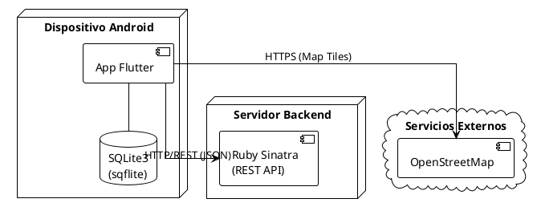
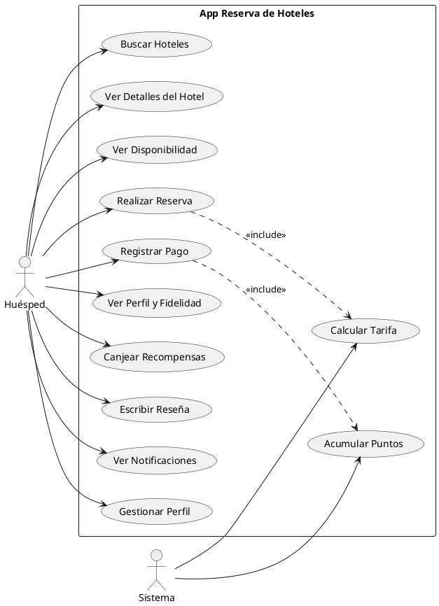
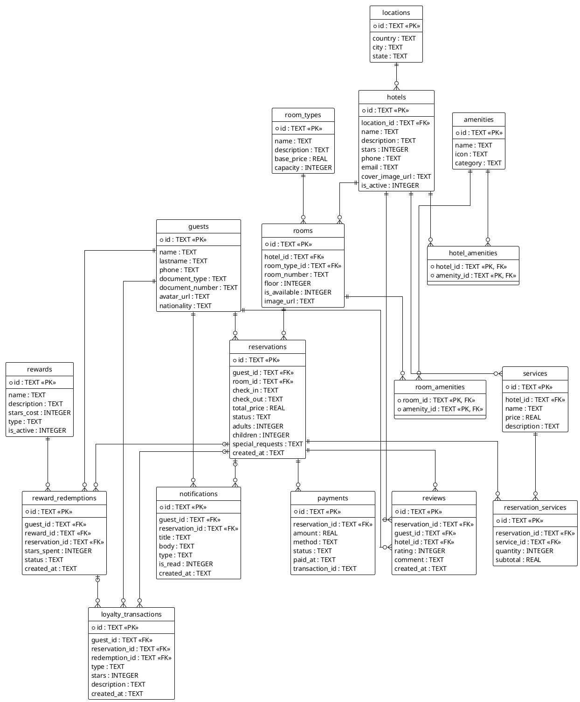

# Sistema de Reserva de Hoteles — App Móvil

**Equipo:**

| Nombre | Código | GitHub |
|---|---|---|
| Walter Melendez | 20231805 | [@Walturx](https://github.com/Walturx) |
| Jean Carlo Rado | 20235056 | [@AidenArcadia](https://github.com/AidenArcadia) |
| Sebastian Candiotti | 20230977 | [@Sebastian-D-Candiotti](https://github.com/Sebastian-D-Candiotti) |
| Joaquin Gonzales | 20231304 | [@Joaquin0804](https://github.com/Joaquin0804) |

**Tema:** Reserva de Hotel

---

## 1. Entorno de Desarrollo

Para el desarrollo de esta aplicación móvil se utiliza un stack que permite alta disponibilidad, desarrollo multiplataforma y fácil despliegue local.

| Herramienta | Descripción | Proceso de instalación |
|---|---|---|
| **Google Antigravity** | IDE principal para escribir código Flutter/Dart | Descargar e instalar desde la web oficial de Google. Agregar las extensiones de **Flutter** y **Dart** desde el marketplace integrado. |
| **Flutter SDK** | Framework para desarrollo de apps Android multiplataforma | Descargar el SDK, extraerlo en `C:\flutter`, agregar `C:\flutter\bin` al `PATH` del sistema. Ejecutar `flutter doctor` para verificar dependencias. |
| **Android Studio** | Gestión de emuladores y Android SDK | Instalar desde la web oficial, configurar un dispositivo virtual (AVD) con API 30+. |
| **sqflite (SQLite3)** | Motor de base de datos local embebido en el dispositivo | Se integra mediante la dependencia `sqflite` en `pubspec.yaml`. No requiere instalación externa. |
| **GitHub** | Control de versiones y publicación del proyecto | Crear repositorio en [github.com](https://github.com) y usar comandos `git` para el manejo de ramas y commits. |

---

## 2. Requerimientos No Funcionales

| ID | Requerimiento | Descripción |
|---|---|---|
| RNF-01 | **Disponibilidad offline** | El sistema debe permitir acceder a la información de reservas locales incluso sin conexión a internet. |
| RNF-02 | **Seguridad** | Los datos sensibles del huésped (documentos) deben estar protegidos con cifrado básico en la base de datos local. |
| RNF-03 | **Rendimiento** | El tiempo de respuesta para la búsqueda de hoteles no debe superar los 2 segundos bajo condiciones normales. |
| RNF-04 | **Usabilidad** | La interfaz debe seguir las guías de Material Design para asegurar una curva de aprendizaje mínima. |

### Diagrama de Despliegue



---

## 3. Requerimientos Funcionales

### Diagrama de Casos de Uso



### 3.1. Módulo de Gestión de Alojamiento

| ID | Requerimiento | Tablas |
|---|---|---|
| RF-01 | El sistema debe permitir al usuario filtrar hoteles por país, ciudad o provincia. | `hotels`, `locations` |
| RF-02 | El sistema debe mostrar la descripción, estrellas, teléfono y amenidades de un hotel seleccionado. | `hotels`, `amenities` |
| RF-03 | El sistema debe listar solo las habitaciones con `is_available = 1` para las fechas seleccionadas. | `rooms` |

### 3.2. Módulo de Reservas y Pagos

| ID | Requerimiento | Tablas |
|---|---|---|
| RF-04 | El sistema debe permitir al huésped crear una reserva indicando fechas de entrada/salida y cantidad de personas. | `reservations` |
| RF-05 | El sistema debe calcular automáticamente el `total_price` (precio base × duración + servicios adicionales). | `room_types`, `reservation_services` |
| RF-06 | El sistema debe registrar el pago (tarjeta, efectivo o transferencia) y actualizar el estado de la reserva a `confirmed`. | `payments` |

### 3.3. Módulo de Fidelización (Loyalty Program)

| ID | Requerimiento | Tablas |
|---|---|---|
| RF-07 | Al completar una estancia, el sistema debe registrar el movimiento de estrellas del huésped. | `loyalty_transactions` |
| RF-08 | El sistema debe subir de nivel al usuario (Bronze → Silver → Gold) según sus estrellas acumuladas. | `loyalty_transactions` |
| RF-09 | El huésped podrá canjear sus estrellas por recompensas activas (noches gratis, regalos). | `rewards`, `reward_redemptions` |

### 3.4. Módulo de Experiencia del Usuario

| ID | Requerimiento | Tablas |
|---|---|---|
| RF-10 | El huésped puede calificar y comentar su experiencia solo después de completar su reserva. | `reviews` |
| RF-11 | El sistema debe enviar alertas automáticas sobre confirmación de reservas y promociones. | `notifications` |
| RF-12 | El usuario puede actualizar sus datos personales, documento y foto de perfil. | `guests` |

---

## 4. Descripción de Casos de Uso

### CU01: Realizar Reserva

| Campo | Detalle |
|---|---|
| **Actor** | Huésped |
| **Descripción** | El huésped busca un hotel por ciudad, selecciona fechas de entrada y salida, elige una habitación disponible y confirma la reserva. |
| **Precondición** | El huésped debe estar autenticado en la app. |
| **Flujo principal** | 1. Ingresa ciudad/país en la barra de búsqueda. 2. El sistema lista hoteles disponibles (`hotels`, `locations`). 3. Selecciona un hotel y ve sus habitaciones disponibles (`rooms`, `is_available = 1`). 4. Elige habitación e ingresa fechas y cantidad de personas. 5. El sistema calcula el `total_price`. 6. El huésped confirma y se crea el registro en `reservations` con estado `pending`. |
| **Tablas** | `hotels`, `locations`, `rooms`, `room_types`, `reservations` |
| **Mockup** | *(ver pantalla en Canva — pendiente)* |

---

### CU02: Ver Perfil y Fidelidad

| Campo | Detalle |
|---|---|
| **Actor** | Huésped |
| **Descripción** | El usuario consulta su nivel de socio (Bronze/Silver/Gold) y cuántas estrellas tiene disponibles para canjear. |
| **Precondición** | El huésped debe tener al menos una reserva completada. |
| **Flujo principal** | 1. El huésped accede a la sección "Mi Perfil". 2. El sistema consulta `guests` y calcula las estrellas desde `loyalty_transactions`. 3. Se muestra el nivel actual y estrellas acumuladas. 4. Se visualiza una barra de progreso hacia el siguiente nivel. |
| **Tablas** | `guests`, `loyalty_transactions` |
| **Mockup** | *(ver pantalla en Canva — pendiente)* |

---

### CU03: Canjear Recompensas

| Campo | Detalle |
|---|---|
| **Actor** | Huésped |
| **Descripción** | El huésped selecciona un beneficio activo (ej. Desayuno Gratis) y utiliza sus estrellas acumuladas para canjearlo. |
| **Precondición** | El huésped debe tener estrellas disponibles suficientes (`available_stars >= stars_cost`). |
| **Flujo principal** | 1. El huésped accede a "Recompensas". 2. El sistema lista las recompensas activas (`rewards`, `is_active = 1`). 3. El huésped selecciona una recompensa y confirma el canje. 4. Se crea un registro en `reward_redemptions` y se registra el gasto en `loyalty_transactions`. |
| **Tablas** | `rewards`, `reward_redemptions`, `loyalty_transactions` |
| **Mockup** | *(ver pantalla en Canva — pendiente)* |

---

## 5. Modelo de Base de Datos

> El diagrama completo se encuentra en [`der_sqlite3.puml`](./der_sqlite3.puml).

### Diagrama Entidad-Relación (SQLite3)



### DDL SQLite3

> Todos los IDs son `TEXT` (UUID generado en app). Fechas como `TEXT` ISO8601. Booleanos como `INTEGER` (0/1).

```sql
-- 1. locations
CREATE TABLE locations (
    id      TEXT PRIMARY KEY,
    country TEXT NOT NULL,
    city    TEXT NOT NULL,
    state   TEXT NOT NULL
);

-- 2. hotels
CREATE TABLE hotels (
    id               TEXT    PRIMARY KEY,
    location_id      TEXT    NOT NULL,
    name             TEXT    NOT NULL,
    description      TEXT,
    stars            INTEGER CHECK (stars BETWEEN 1 AND 5),
    phone            TEXT,
    email            TEXT,
    cover_image_url  TEXT,
    is_active        INTEGER DEFAULT 1,
    FOREIGN KEY (location_id) REFERENCES locations(id) ON DELETE CASCADE
);

-- 3. room_types
CREATE TABLE room_types (
    id          TEXT PRIMARY KEY,
    name        TEXT NOT NULL,
    description TEXT,
    base_price  REAL NOT NULL DEFAULT 0,
    capacity    INTEGER NOT NULL CHECK (capacity > 0)
);

-- 4. rooms
CREATE TABLE rooms (
    id            TEXT    PRIMARY KEY,
    hotel_id      TEXT    NOT NULL,
    room_type_id  TEXT    NOT NULL,
    room_number   TEXT    NOT NULL,
    floor         INTEGER,
    is_available  INTEGER DEFAULT 1,
    image_url     TEXT,
    FOREIGN KEY (hotel_id)     REFERENCES hotels(id)     ON DELETE CASCADE,
    FOREIGN KEY (room_type_id) REFERENCES room_types(id) ON DELETE RESTRICT
);

-- 5. guests
CREATE TABLE guests (
    id              TEXT PRIMARY KEY,
    name            TEXT NOT NULL,
    lastname        TEXT NOT NULL,
    phone           TEXT,
    document_type   TEXT,
    document_number TEXT UNIQUE,
    avatar_url      TEXT,
    nationality     TEXT
);

-- 6. reservations
CREATE TABLE reservations (
    id               TEXT PRIMARY KEY,
    guest_id         TEXT NOT NULL,
    room_id          TEXT NOT NULL,
    check_in         TEXT NOT NULL,           -- YYYY-MM-DD HH:MM:SS
    check_out        TEXT NOT NULL,           -- YYYY-MM-DD HH:MM:SS
    total_price      REAL NOT NULL,
    status           TEXT NOT NULL DEFAULT 'pending'
                          CHECK (status IN ('pending','confirmed','cancelled','completed')),
    adults           INTEGER NOT NULL DEFAULT 1,
    children         INTEGER DEFAULT 0,
    special_requests TEXT,
    created_at       TEXT DEFAULT CURRENT_TIMESTAMP,
    FOREIGN KEY (guest_id) REFERENCES guests(id) ON DELETE CASCADE,
    FOREIGN KEY (room_id)  REFERENCES rooms(id)  ON DELETE RESTRICT
);

-- 7. payments
CREATE TABLE payments (
    id             TEXT PRIMARY KEY,
    reservation_id TEXT NOT NULL,
    amount         REAL NOT NULL,
    method         TEXT CHECK (method IN ('card','transfer','cash')),
    status         TEXT DEFAULT 'pending'
                        CHECK (status IN ('pending','approved','refunded')),
    paid_at        TEXT,                      -- YYYY-MM-DD HH:MM:SS
    transaction_id TEXT,
    FOREIGN KEY (reservation_id) REFERENCES reservations(id) ON DELETE CASCADE
);

-- 8. reviews
CREATE TABLE reviews (
    id             TEXT PRIMARY KEY,
    reservation_id TEXT UNIQUE NOT NULL,
    guest_id       TEXT NOT NULL,
    hotel_id       TEXT NOT NULL,
    rating         INTEGER CHECK (rating BETWEEN 1 AND 5),
    comment        TEXT,
    created_at     TEXT DEFAULT CURRENT_TIMESTAMP,
    FOREIGN KEY (reservation_id) REFERENCES reservations(id) ON DELETE CASCADE,
    FOREIGN KEY (guest_id)       REFERENCES guests(id),
    FOREIGN KEY (hotel_id)       REFERENCES hotels(id)
);

-- 9. amenities
CREATE TABLE amenities (
    id       TEXT PRIMARY KEY,
    name     TEXT NOT NULL,
    icon     TEXT,
    category TEXT CHECK (category IN ('hotel','room'))
);

-- 10. hotel_amenities
CREATE TABLE hotel_amenities (
    hotel_id   TEXT NOT NULL,
    amenity_id TEXT NOT NULL,
    PRIMARY KEY (hotel_id, amenity_id),
    FOREIGN KEY (hotel_id)   REFERENCES hotels(id)    ON DELETE CASCADE,
    FOREIGN KEY (amenity_id) REFERENCES amenities(id) ON DELETE CASCADE
);

-- 11. room_amenities
CREATE TABLE room_amenities (
    room_id    TEXT NOT NULL,
    amenity_id TEXT NOT NULL,
    PRIMARY KEY (room_id, amenity_id),
    FOREIGN KEY (room_id)    REFERENCES rooms(id)     ON DELETE CASCADE,
    FOREIGN KEY (amenity_id) REFERENCES amenities(id) ON DELETE CASCADE
);

-- 12. services
CREATE TABLE services (
    id          TEXT PRIMARY KEY,
    hotel_id    TEXT NOT NULL,
    name        TEXT NOT NULL,
    price       REAL NOT NULL DEFAULT 0,
    description TEXT,
    FOREIGN KEY (hotel_id) REFERENCES hotels(id) ON DELETE CASCADE
);

-- 13. reservation_services
CREATE TABLE reservation_services (
    id             TEXT    PRIMARY KEY,
    reservation_id TEXT    NOT NULL,
    service_id     TEXT    NOT NULL,
    quantity       INTEGER DEFAULT 1,
    subtotal       REAL    NOT NULL,
    FOREIGN KEY (reservation_id) REFERENCES reservations(id) ON DELETE CASCADE,
    FOREIGN KEY (service_id)     REFERENCES services(id)
);


-- 16. rewards
CREATE TABLE rewards (
    id          TEXT    PRIMARY KEY,
    name        TEXT    NOT NULL,
    description TEXT,
    stars_cost  INTEGER NOT NULL,
    type        TEXT    CHECK (type IN ('discount','free_night','service','upgrade')),
    is_active   INTEGER DEFAULT 1
);

-- 17. reward_redemptions
CREATE TABLE reward_redemptions (
    id             TEXT    PRIMARY KEY,
    guest_id       TEXT    NOT NULL,
    reward_id      TEXT    NOT NULL,
    reservation_id TEXT,
    stars_spent    INTEGER NOT NULL,
    status         TEXT    DEFAULT 'pending'
                           CHECK (status IN ('pending','applied','expired')),
    created_at     TEXT    DEFAULT CURRENT_TIMESTAMP,
    FOREIGN KEY (guest_id)       REFERENCES guests(id),
    FOREIGN KEY (reward_id)      REFERENCES rewards(id),
    FOREIGN KEY (reservation_id) REFERENCES reservations(id)
);

-- 18. loyalty_transactions
CREATE TABLE loyalty_transactions (
    id             TEXT    PRIMARY KEY,
    guest_id       TEXT    NOT NULL,
    reservation_id TEXT,
    redemption_id  TEXT,
    type           TEXT    NOT NULL
                           CHECK (type IN ('earned','redeemed','bonus','expired')),
    stars          INTEGER NOT NULL,
    description    TEXT,
    created_at     TEXT    DEFAULT CURRENT_TIMESTAMP,
    FOREIGN KEY (guest_id)       REFERENCES guests(id),
    FOREIGN KEY (reservation_id) REFERENCES reservations(id),
    FOREIGN KEY (redemption_id)  REFERENCES reward_redemptions(id)
);

-- 19. notifications
CREATE TABLE notifications (
    id             TEXT    PRIMARY KEY,
    guest_id       TEXT    NOT NULL,
    reservation_id TEXT,
    title          TEXT    NOT NULL,
    body           TEXT    NOT NULL,
    type           TEXT    CHECK (type IN ('confirmation','reminder','promo')),
    is_read        INTEGER DEFAULT 0,
    created_at     TEXT    DEFAULT CURRENT_TIMESTAMP,
    FOREIGN KEY (guest_id)       REFERENCES guests(id) ON DELETE CASCADE,
    FOREIGN KEY (reservation_id) REFERENCES reservations(id)
);
```

---

## 6. Diccionario de Datos

### locations

| Columna | Tipo | Restricciones | Descripción |
|---|---|---|---|
| id | TEXT | PK | UUID identificador único |
| country | TEXT | NOT NULL | País |
| city | TEXT | NOT NULL | Ciudad |
| state | TEXT | NOT NULL | Provincia / Estado |

### hotels

| Columna | Tipo | Restricciones | Descripción |
|---|---|---|---|
| id | TEXT | PK | UUID identificador único |
| location_id | TEXT | FK → locations | Ubicación del hotel |
| name | TEXT | NOT NULL | Nombre del hotel |
| description | TEXT | | Descripción general |
| stars | INTEGER | CHECK 1–5 | Categoría en estrellas |
| phone | TEXT | | Teléfono de contacto |
| email | TEXT | | Email de contacto |
| cover_image_url | TEXT | | URL imagen principal |
| is_active | INTEGER | DEFAULT 1 | 1 = activo, 0 = inactivo |

### room_types

| Columna | Tipo | Restricciones | Descripción |
|---|---|---|---|
| id | TEXT | PK | UUID identificador único |
| name | TEXT | NOT NULL | Simple, Doble, Suite, etc. |
| description | TEXT | | Descripción del tipo |
| base_price | REAL | NOT NULL | Precio base por noche |
| capacity | INTEGER | NOT NULL, > 0 | Capacidad máxima de personas |

### rooms

| Columna | Tipo | Restricciones | Descripción |
|---|---|---|---|
| id | TEXT | PK | UUID identificador único |
| hotel_id | TEXT | FK → hotels | Hotel al que pertenece |
| room_type_id | TEXT | FK → room_types | Tipo de habitación |
| room_number | TEXT | NOT NULL | Número/código de habitación |
| floor | INTEGER | | Piso |
| is_available | INTEGER | DEFAULT 1 | 1 = disponible, 0 = no disponible |
| image_url | TEXT | | URL imagen de la habitación |

### guests

| Columna | Tipo | Restricciones | Descripción |
|---|---|---|---|
| id | TEXT | PK | UUID identificador único |
| name | TEXT | NOT NULL | Nombre |
| lastname | TEXT | NOT NULL | Apellido |
| phone | TEXT | | Teléfono |
| document_type | TEXT | | DNI / Pasaporte / CE |
| document_number | TEXT | UNIQUE | Número de documento |
| avatar_url | TEXT | | URL foto de perfil |
| nationality | TEXT | | Nacionalidad |

### reservations

| Columna | Tipo | Restricciones | Descripción |
|---|---|---|---|
| id | TEXT | PK | UUID identificador único |
| guest_id | TEXT | FK → guests | Huésped que reserva |
| room_id | TEXT | FK → rooms | Habitación reservada |
| check_in | TEXT | NOT NULL | Fecha y hora de entrada (YYYY-MM-DD HH:MM:SS) |
| check_out | TEXT | NOT NULL | Fecha y hora de salida (YYYY-MM-DD HH:MM:SS) |
| total_price | REAL | NOT NULL | Precio total calculado |
| status | TEXT | DEFAULT 'pending' | pending / confirmed / cancelled / completed |
| adults | INTEGER | DEFAULT 1 | Cantidad de adultos |
| children | INTEGER | DEFAULT 0 | Cantidad de niños |
| special_requests | TEXT | | Solicitudes especiales |
| created_at | TEXT | DEFAULT CURRENT_TIMESTAMP | Fecha de creación (YYYY-MM-DD HH:MM:SS) |

### payments

| Columna | Tipo | Restricciones | Descripción |
|---|---|---|---|
| id | TEXT | PK | UUID identificador único |
| reservation_id | TEXT | FK → reservations | Reserva asociada |
| amount | REAL | NOT NULL | Monto pagado |
| method | TEXT | | card / transfer / cash |
| status | TEXT | DEFAULT 'pending' | pending / approved / refunded |
| paid_at | TEXT | | Fecha y hora del pago (YYYY-MM-DD HH:MM:SS) |
| transaction_id | TEXT | | ID externo del pago |

### reviews

| Columna | Tipo | Restricciones | Descripción |
|---|---|---|---|
| id | TEXT | PK | UUID identificador único |
| reservation_id | TEXT | FK → reservations, UNIQUE | Una reseña por reserva |
| guest_id | TEXT | FK → guests | Huésped que reseña |
| hotel_id | TEXT | FK → hotels | Hotel reseñado |
| rating | INTEGER | CHECK 1–5 | Calificación |
| comment | TEXT | | Comentario |
| created_at | TEXT | DEFAULT CURRENT_TIMESTAMP | Fecha de la reseña |

### amenities

| Columna | Tipo | Restricciones | Descripción |
|---|---|---|---|
| id | TEXT | PK | UUID identificador único |
| name | TEXT | NOT NULL | WiFi, Piscina, Gimnasio, etc. |
| icon | TEXT | | Nombre del ícono |
| category | TEXT | CHECK hotel/room | Aplica a hotel o habitación |

### hotel_amenities

| Columna | Tipo | Restricciones | Descripción |
|---|---|---|---|
| hotel_id | TEXT | PK, FK → hotels | Hotel |
| amenity_id | TEXT | PK, FK → amenities | Amenidad |

### room_amenities

| Columna | Tipo | Restricciones | Descripción |
|---|---|---|---|
| room_id | TEXT | PK, FK → rooms | Habitación |
| amenity_id | TEXT | PK, FK → amenities | Amenidad |

### services

| Columna | Tipo | Restricciones | Descripción |
|---|---|---|---|
| id | TEXT | PK | UUID identificador único |
| hotel_id | TEXT | FK → hotels | Hotel que ofrece el servicio |
| name | TEXT | NOT NULL | Desayuno, Spa, Transfer, etc. |
| price | REAL | NOT NULL | Precio del servicio |
| description | TEXT | | Descripción |

### reservation_services

| Columna | Tipo | Restricciones | Descripción |
|---|---|---|---|
| id | TEXT | PK | UUID identificador único |
| reservation_id | TEXT | FK → reservations | Reserva asociada |
| service_id | TEXT | FK → services | Servicio contratado |
| quantity | INTEGER | DEFAULT 1 | Cantidad contratada |
| subtotal | REAL | NOT NULL | Precio total del servicio |


### loyalty_transactions

| Columna | Tipo | Restricciones | Descripción |
|---|---|---|---|
| id | TEXT | PK | UUID identificador único |
| guest_id | TEXT | FK → guests | Huésped |
| reservation_id | TEXT | FK → reservations, nullable | Reserva origen (si aplica) |
| redemption_id | TEXT | FK → reward_redemptions, nullable | Canje origen (si aplica) |
| type | TEXT | NOT NULL | earned / redeemed / bonus / expired |
| stars | INTEGER | NOT NULL | Positivo = ganadas, negativo = gastadas |
| description | TEXT | | Motivo del movimiento |
| created_at | TEXT | DEFAULT CURRENT_TIMESTAMP | Fecha del movimiento |

### rewards

| Columna | Tipo | Restricciones | Descripción |
|---|---|---|---|
| id | TEXT | PK | UUID identificador único |
| name | TEXT | NOT NULL | Noche gratis, Upgrade, Desayuno, etc. |
| description | TEXT | | Descripción del beneficio |
| stars_cost | INTEGER | NOT NULL | Estrellas necesarias para canjear |
| type | TEXT | | discount / free_night / service / upgrade |
| is_active | INTEGER | DEFAULT 1 | 1 = activa, 0 = inactiva |

### reward_redemptions

| Columna | Tipo | Restricciones | Descripción |
|---|---|---|---|
| id | TEXT | PK | UUID identificador único |
| guest_id | TEXT | FK → guests | Huésped que canjea |
| reward_id | TEXT | FK → rewards | Recompensa canjeada |
| reservation_id | TEXT | FK → reservations, nullable | Reserva asociada (opcional) |
| stars_spent | INTEGER | NOT NULL | Estrellas utilizadas |
| status | TEXT | DEFAULT 'pending' | pending / applied / expired |
| created_at | TEXT | DEFAULT CURRENT_TIMESTAMP | Fecha del canje |

### notifications

| Columna | Tipo | Restricciones | Descripción |
|---|---|---|---|
| id | TEXT | PK | UUID identificador único |
| guest_id | TEXT | FK → guests | Huésped destinatario |
| reservation_id | TEXT | FK → reservations, nullable | Reserva relacionada (opcional) |
| title | TEXT | NOT NULL | Título de la notificación |
| body | TEXT | NOT NULL | Cuerpo del mensaje |
| type | TEXT | | confirmation / reminder / promo |
| is_read | INTEGER | DEFAULT 0 | 0 = no leída, 1 = leída |
| created_at | TEXT | DEFAULT CURRENT_TIMESTAMP | Fecha de creación |
